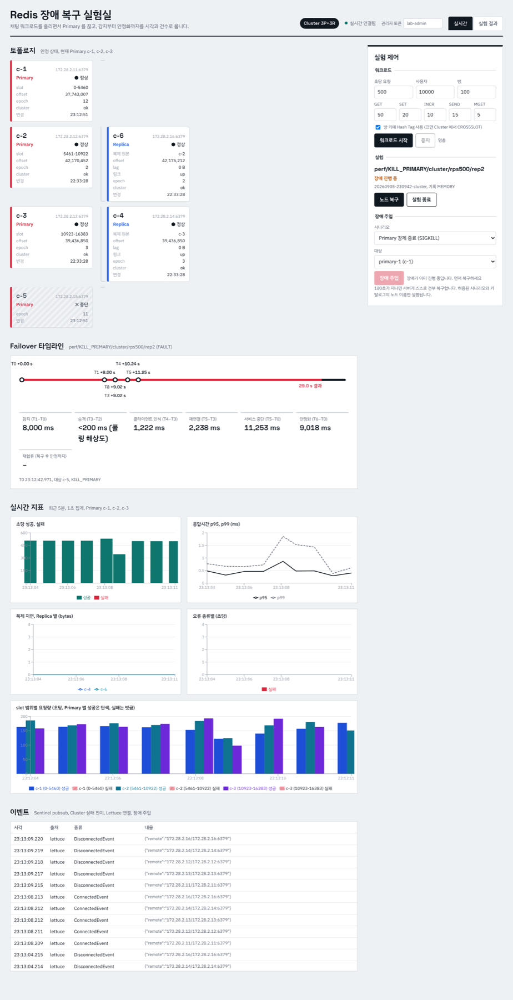
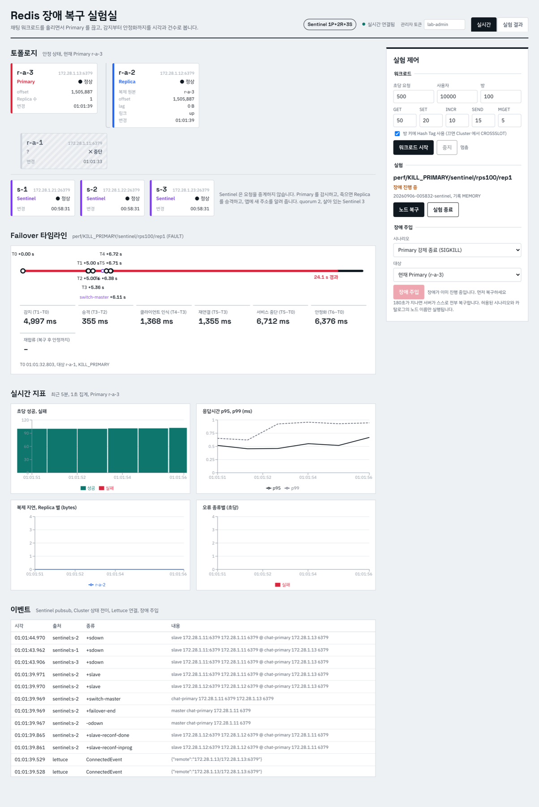

# redis-ha-chat-lab — Redis Sentinel vs Redis Cluster, 장애를 직접 내고 잰 기록

> 가상의 채팅 서비스(메시지 전송·접속 상태·안 읽은 수)를 Redis 위에 올리고, **Redis Sentinel(Primary 1 + Replica 2 + Sentinel 3)** 과 **Redis Cluster(Primary 3 + Replica 3)** 에서 Primary 를 죽이고·멈추고·끊으며 감지 → 승격 → 클라이언트 재연결 → 정상화까지를 시각(T0~T6)과 건수(실패·유실·중복)로 측정했다.
> 이 문서의 모든 수치는 같은 장비·같은 부하에서 **직접 측정한 값**(반복 5회 중앙값)이며, 설계 시점의 예상은 [`docs/DESIGN.md`](docs/DESIGN.md) 에만 남겨 실측과 구분한다.

**한 문장 요약(이력서용).** Redis Sentinel 과 Cluster 위에 같은 채팅 워크로드를 올려 Primary 강제 종료 시 서비스 중단 시간을 각각 **6.6 초와 12.0 초**로 측정하고(300 RPS, 5회 중앙값), Lettuce 토폴로지 갱신·연결 설정을 조정해 Cluster 장애 구간 오류율을 **35.9 % 에서 10.1 %** 로, Sentinel hang 장애의 오류율을 **98.2 % 에서 29.6 %** 로 낮췄다.

---

## 1. 왜 이 실험을 했나

"Redis 는 Sentinel 로 HA 를 구성했습니다" 라는 문장 뒤에는 보통 아무 숫자가 없다. 몇 초 끊기는지, 그 사이 성공 응답을 받은 쓰기가 사라지는지, 클라이언트 라이브러리가 새 Primary 를 언제 아는지는 문서를 읽어도 알 수 없고 재봐야 안다. 채팅은 쓰기가 끊이지 않고 메시지 순번이 하나라도 빠지거나 중복되면 바로 티가 나는 업무라서, Failover 의 부작용을 관찰하는 도메인으로 골랐다.

답하려던 질문은 열 개였다(설계서 1절). 실측으로 확인된 것과 뒤집힌 것을 한 표로 적는다.

| # | 질문 | 설계 시점 예상 | 실측 결과 |
|---|---|---|---|
| 1 | 둘은 각각 어떤 문제를 푸는가 | Sentinel = 자동 Failover, Cluster = Failover + 데이터 분산 | 확인. Cluster 는 장애가 키의 1/3 에만 미쳐 "성공 0건인 초" 가 0 이었다(Sentinel 6 초) |
| 2 | Sentinel Failover 는 몇 초인가 | down-after(5 s) + 1~2 s | 확인. 감지 5.0 s + 승격 0.3 s + 클라이언트 1.2 s = **6.6 s** |
| 3 | Cluster 는 담당 Replica 가 승격되는가 | node-timeout(5 s) 후 선거 → 같은 slot 담당 | 확인. 단 FAIL 확정이 gossip 때문에 7.1 s, 승격 0.8 s, 클라이언트 갱신 2.6 s → **12.0 s** |
| 4 | Cluster 장애 중 전부 실패하는가 | 약 1/3 만 실패, slot 이 비면 전체 CLUSTERDOWN | 확인. 오류율 11.8 %(Sentinel 13.6 %)로 비슷하지만 분포가 다르고, slot 공백에서는 88.6 % 전면 장애 |
| 5 | Lettuce 는 승격을 언제 아는가 | Sentinel 은 `+switch-master` 구독으로 즉시, Cluster 는 갱신 설정에 좌우 | **반은 기각.** Spring Boot 기본 Sentinel 연결은 `+switch-master` 를 구독하지 않아 hang 장애에서 40 s 동안 옛 Primary 를 붙들었다. Cluster 는 갱신 없이 5회 중 3회 복구 실패 |
| 6 | 승인된 쓰기가 유실될 수 있는가 | 있다(비동기 복제) | 확인. 복제 지연 0.5 s 에서 Sentinel 25건(0.37 %). Cluster 의 유실 35건은 복제가 아니라 **끊긴 동안 버퍼된 명령의 늦은 실행**이 원인 |
| 7 | 재시도로 INCR 이 중복되는가 | 있다(command replay), 멱등 Lua 는 0 | 확인. Cluster 30건, 앱 재시도를 켜면 66건. 멱등 SEND 의 스트림 중복은 0 |
| 8 | 복제 지연 상태에서 죽으면 | 지연만큼 유실, min-replicas 는 초 단위라 못 막음 | 확인. `min-replicas-max-lag 1` 로도 32건 그대로 |
| 9 | 옛 Primary 는 돌아오면 무엇인가 | Replica 로 합류, 분기 쓰기는 폐기 | 확인. 합류 Cluster 0.5 s, Sentinel 10 s(그 10 초가 유실 창) |
| 10 | 처리량·오류율·복잡도 차이 | 정상 TPS 는 비슷, 중단은 timeout 이 지배 | 확인. 중단 시간은 감지 설정에 선형(1 s 설정 → 2.2 s / 4.3 s) |

---

## 2. 이야기 순서로 읽는 결과

### 2.1 Redis 한 대는 SPOF 다 → Replica 를 붙였다 → 그래도 누군가 승격을 결정해야 한다

Replica 는 데이터를 복제하지만 Primary 가 죽었을 때 스스로 승격하지 않는다. 누가 "죽었다" 를 판단하고 "너가 Primary 다" 를 말할 것인가 — 이것이 Sentinel 의 역할이다. Sentinel 은 **프록시가 아니다.** 앱은 Sentinel 에 주소를 물어본 뒤 Redis 에 직접 붙는다. 이 한 문장이 이후 실험 결과의 절반을 설명한다.

### 2.2 Sentinel 을 붙이고 Primary 를 SIGKILL 했다

| 지표 (300 RPS, 5회 중앙값) | Sentinel | Cluster |
|---|---:|---:|
| 장애 감지(T1−T0) | 5,008 ms | 7,114 ms |
| Replica 승격(T3−T2) | 335 ms | 811 ms |
| 클라이언트 인식(T4−T3) | 1,178 ms | 2,562 ms |
| **서비스 중단(첫 쓰기 실패 → 첫 성공)** | **6,566 ms** | **12,032 ms** |
| 장애 중 오류율(40 s 창) | 13.6 % | 11.8 % |
| 성공 0건인 초 | 6 s | 0 s |
| 승인 쓰기 유실 / INCR 중복 | 0 / 0 | 35 / 30 |
| 옛 Primary 재합류 | 10,505 ms | 501 ms |

Sentinel 중단 시간은 `down-after-milliseconds`(5 s) 가 지배하고 나머지는 1 초 남짓이다. Cluster 는 같은 5 s 설정에서도 gossip 으로 FAIL 을 확정하는 데 7 초가 걸리고, 승격 뒤 클라이언트가 slot 맵을 다시 읽는 데 2.6 초가 더 든다. 대신 Cluster 는 장애가 1/3 의 키에만 미쳐 "아무 요청도 성공하지 못한 초" 가 없었다. → [`EXP-AB`](docs/experiments/EXP-AB-primary-termination.md)

### 2.3 죽이는 대신 멈추면(hang) 결과가 달라진다

`docker pause` 로 프로세스만 멈추면 TCP 연결은 살아 있다. Sentinel 은 5.4 s 에 ODOWN 을 내고 0.8 s 뒤 승격했지만, **앱은 40 초 동안 옛 Primary 에 명령을 보내며 전부 타임아웃**했다(오류율 98.2 %, 승인 쓰기 1,310건 유실). Spring Boot 의 기본 Sentinel 연결(`RedisClient` 단일 연결)은 `+switch-master` 를 구독하지 않고, 연결이 끊기지 않으니 Sentinel 에 다시 물어볼 계기도 없다. Cluster 는 같은 장애에서 10.5 s 에 복구됐다(살아 있는 노드가 MOVED 로 안내). → [`EXP-AB`](docs/experiments/EXP-AB-primary-termination.md), [`EXP-C`](docs/experiments/EXP-C-network-partition.md)

### 2.4 네트워크 단절은 "누가 못 보느냐" 로 셋으로 갈린다

| 단절 | 결과 |
|---|---|
| Primary ↔ Sentinel (앱은 Primary 를 봄) | Failover 는 됐지만 앱은 옛 Primary 에 계속 씀. **오류 0 %, 승인 쓰기 4,084건(75 %) 조용히 유실** (split-brain) |
| 앱 ↔ Primary 만 | Sentinel 은 정상이라 Failover 없음. 52 s 동안 앱만 멈춤. 복구 후에도 TCP 재전송 백오프로 오류 30 % |
| Primary ↔ 다른 Cluster 노드 | 과반을 못 보는 Primary 가 node-timeout 뒤 스스로 쓰기를 거부 → 유실 151건(2.8 %) 으로 창이 닫힘 |

→ [`EXP-C`](docs/experiments/EXP-C-network-partition.md)

### 2.5 Sentinel 은 한 Primary 에 모든 쓰기가 몰린다 → Cluster 로 나눴다

Cluster 는 16,384 slot 을 세 Primary 에 나눈다. 채팅 키를 `user:{id}:presence`(분산) 와 `room:{42}:*`(Hash Tag, 같은 slot) 로 설계해야 방 단위 Lua(중복 제거 + 순번 + 스트림 추가)가 가능하다. Hash Tag 없이 같은 Lua 를 부르면 `CROSSSLOT` 이 난다(재현 포함). → [`EXP-CROSSSLOT`](docs/experiments/EXP-CROSSSLOT-hash-tag.md)

### 2.6 Cluster 의 부분 장애: Primary 와 그 Replica 를 함께 잃으면

slot 0–5460 이 비면 `cluster-require-full-coverage yes`(기본) 에서는 **모든 노드가 모든 키에 CLUSTERDOWN** 을 돌려준다(오류율 88.6 %, 성공 0건 33 초). `no` 로 바꾸면 해당 slot 만 실패해 35.5 %, 성공 0건 0 초. 정합성(빠진 키를 모른 채 서비스하지 않음)과 가용성의 선택이다. → [`EXP-H`](docs/experiments/EXP-H-slot-gap.md), [`EXP-DE`](docs/experiments/EXP-DE-replica-and-quorum.md)

### 2.7 클라이언트가 승격을 모르면 서버가 복구돼도 장애다 (Lettuce 설정)

| Cluster 변형 (SIGKILL) | 서비스 중단 | 장애 중 오류율 | 유실 / 중복 |
|---|---:|---:|---:|
| 토폴로지 갱신 없음 (Lettuce 라이브러리 기본값) | 46,535 ms (5회 중 3회 복구까지 실패) | 35.9 % | 0 / 103 |
| adaptive 만 | 47,608 ms (5회 모두 실패) | 36.5 % | 0 / 102 |
| adaptive 만 + 쿨다운 30 → 5 s | 11,660 ms | 11.6 % | 40 / 31 |
| periodic 60 s 만 | 42,471 ms | 36.0 % | 10 / 87 |
| **adaptive + periodic 5 s** (이 실험의 기준) | **9,655 ms** | **10.1 %** | 28 / 27 |
| **adaptive + periodic 5 s + `REJECT_COMMANDS`** | 9,633 ms (재현 9,768) | 10.0 % | **0 / 0** |

adaptive 만 켜면 실패하는 이유: 재연결 실패 트리거가 kill 뒤 약 5 s 에 갱신을 한 번 돌리는데 그때는 FAIL 확정(7 s) 전이라 토폴로지가 그대로이고, 다음 갱신은 `adaptiveRefreshTriggersTimeout`(기본 30 s) 쿨다운에 막힌다. 쿨다운을 5 s 로 줄이면 11.7 s 에 복구되지만, 트리거 시각과 서버의 FAIL 확정 시각의 정렬을 운에 맡기지 않는 periodic 5 s 병행(9.7 s)이 더 빨랐다. 유실·중복은 복제가 아니라 **끊긴 동안 버퍼에 쌓인 명령이 재연결 뒤 실행**되는 `DEFAULT` 동작이 원인이었고, `REJECT_COMMANDS` 로 정확히 0 이 됐다.

Sentinel 쪽 해법은 `readFrom=UPSTREAM` 이다. Spring 이 Lettuce `MasterReplica` 연결을 쓰게 되고 이 연결만 `+switch-master` 를 구독한다. hang 장애 40.2 s → 11.9 s(오류율 98.2 % → 29.6 %), split-brain 유실 4,084 → 345. 대가로 단순 종료는 6.6 → 11.1 s 로 느려진다. `TCP_USER_TIMEOUT` 은 멈춘 프로세스의 커널이 계속 ACK 하므로 hang 을 잡지 못했다(40.2 s 그대로). → [`EXP-OPT`](docs/experiments/EXP-OPT-lettuce-options.md)

### 2.8 성공 응답을 받은 쓰기가 사라진다

복제는 비동기다. 복제 지연 500 ms 상태에서 Primary 를 죽이면 Sentinel 에서 승인 쓰기 25건(0.37 %) 이 승격된 Replica 에 없었다. 측정은 앱의 장부(ACK 받은 쓰기 전부)와 복구 후 Redis 의 실제 값을 대조해 `유실률 = (사라진 메시지 + INCR 손실 + 잘못된 값 키) / 승인 쓰기` 로 계산했다. → [`EXP-F`](docs/experiments/EXP-F-replication-lag-loss.md), [`docs/metrics.md`](docs/metrics.md)

### 2.9 안전성 설정은 무엇을 막고 무엇을 못 막나

| 설정 | 막은 것 | 못 막은 것 / 비용 |
|---|---|---|
| `min-replicas-to-write 1`, `max-lag 1` | Sentinel split-brain 유실 4,084 → **73** (NOREPLICAS 로 거부), hang 유실 1,310 → 0 | 500 ms 지연 유실(초 단위 판정)은 그대로 32건. Cluster 에서 Replica 1대면 승격 직후 **40 s 쓰기 거부** |
| AOF `appendfsync always` | 재기동 시 자기 데이터 보존(Replica 없는 재시작의 전량 유실 대책) | 승격 유실과 무관(29건 그대로), 쓰기 p95 0.68 → 1.62 ms |
| `master-reboot-down-after-period 10 s` | — | 빈 상태로 재부팅한 Primary 에 Replica 가 먼저 full resync 해 버려 유실 3,486건(기본 2,790보다 큼) |
| `WAIT 1`(쓰기 뒤 Replica 1대 ACK 대기) | 복제 지연 500 ms 유실 Sentinel 29 → **0**(5회 모두) | 지연 상태에서 쓰기 p95 0.7 ms → 약 950 ms. 대기가 1 s 를 넘으면 TIMEOUT 으로 실패 처리되지만 이미 반영된 INCR 이 생김(2회, 51·30건) — WAIT 실패는 "복제 확인 안 됨" 이지 "쓰기 안 됨" 이 아니다. Cluster 는 유실 40 → 7 이지만 Replica 1대 구성에서 승격 후 **40 s 쓰기 거부**(min-replicas 와 같은 절벽) |

→ [`EXP-SETTINGS`](docs/experiments/EXP-SETTINGS-data-safety.md), [`EXP-TIMING`](docs/experiments/EXP-TIMING-coverage.md)

### 2.10 감지 시간 설정이 첫 번째 결정 요인이다

| 설정 | Sentinel 중단 | Cluster 중단 | 정상 시 오탐 |
|---|---:|---:|---:|
| 1 s | 2,159 ms | 4,332 ms | 0 % |
| 5 s (실험 기본) | 6,566 ms | 12,032 ms | 0 % |
| 15 s | 19,976 ms | 25,151 ms | 0 % |

같은 VM 안이라 1 s 로 줄여도 오탐이 없었다. 실제 네트워크에서는 오탐(불필요한 Failover)을 만들 수 있으므로 "이 환경의 하한" 으로만 읽는다. → [`EXP-TIMING`](docs/experiments/EXP-TIMING-coverage.md)

### 2.11 선택 기준

Primary 한 대의 메모리와 쓰기 처리량으로 충분하고 멀티키 연산·기존 코드를 그대로 쓰고 싶으면 **Sentinel**. 단, `readFrom=UPSTREAM`(MasterReplica) 없이는 hang·파티션에 40 초 이상 무방비이고 `min-replicas-to-write` 없이는 split-brain 유실을 조용히 겪는다. 데이터·쓰기를 나눠야 하거나 장애 범위를 1/3 로 줄이는 것이 중요하면 **Cluster**. 단, Lettuce 갱신 옵션(adaptive + periodic) 과 `REJECT_COMMANDS` 를 켜지 않으면 서버가 복구돼도 클라이언트는 40 초를 넘게 잃고, 키 설계(Hash Tag)가 곧 트랜잭션 설계가 된다. → [`ADR-001`](docs/adr/ADR-001-sentinel-vs-cluster.md)

### 2.12 부하를 올리면 병목은 Redis 가 아니라 앱 스레드 풀이었다

k6 로 100 / 500 / 1,000 / 2,000 RPS 를 걸고 각 단계에서 Primary 를 SIGKILL 했다(각 5회). 정상 구간은 2,000 RPS 까지 두 구성 모두 오류 0, p95 1.3 ms 이하로 차이가 없었고 Redis CPU 는 10 % 미만이었다. 장애 구간에서는 500 RPS 부터 **Tomcat 200 스레드가 죽은 Primary 를 1 초씩 기다리는 요청으로 가득 차** Sentinel 의 TIMEOUT 건수가 RPS 와 무관하게 1,000~1,200 으로 고정됐고, 나머지 요청은 대기열에서 기다려 p99 가 1.0 → 2.6 → 3.6 → 4.1 s 로 늘었으며 2,000 RPS 에서는 k6 의 5 s 타임아웃과 VU 소진(드롭 3 %)이 나타났다. 오류율은 4.25 % → 0.90 % 로 "좋아지는" 것처럼 보이지만 오류 + 드롭을 합치면 어느 단계에서나 약 4 % 다. Cluster 는 Redis 수준에서 1/3 키만 실패했지만 앱 스레드 풀이 격리되지 않아 1,000 RPS 부터 장애 구간 p95 가 1 s 에 닿았다(Sentinel 0.9 ms). → [`EXP-PERF`](docs/experiments/EXP-PERF-load-stages.md)

기록 방식(MEMORY / BATCH / SAMPLED)은 Redis 명령 p95 와 앱 CPU 에 측정 가능한 부담을 주지 않았고(1,000 RPS, 드롭 0), 앱↔Sentinel 경로를 Toxiproxy 로 끊거나 지연시켜도 오류 0 이었다 — Sentinel 은 데이터 경로에 없다. → [`EXP-MISC`](docs/experiments/EXP-MISC-recording-and-toxiproxy.md)

---

## 3. 구성

```text
호스트(macOS)                     Docker Compose 네트워크 lab-net (172.28.0.0/16, 고정 IP)
┌──────────────┐  :8085  ┌──────────────────────────────────────────────────────────────┐
│ k6           │──HTTP──▶│ lab-app (Spring Boot 3.5, Java 21, Lettuce 6.6)               │
│ React(Vite)  │──/api──▶│  ├ ChatStore(Lua: 멱등 SEND, JOIN)   Sentinel: r-a-1..3 + s-1..3│
│ :5182        │         │  ├ WorkloadRunner(앱 내부 부하)       Cluster : c-1..c-6         │
└──────────────┘         │  ├ ExperimentService ─▶ docker-socket-proxy ─▶ Docker API      │
                         │  ├ FaultExecutor ─▶ fault-agent 사이드카(iptables/tc, netns 공유)│
                         │  │                ─▶ toxiproxy(앱↔Sentinel 경로만)              │
                         │  ├ TopologyWatcher(Sentinel pubsub / CLUSTER NODES 200 ms)     │
                         │  └ RecordingService ─▶ MySQL 8 (:3309, 실험 기록 전용)          │
                         │ redis_exporter ─▶ Prometheus(:9093) ─▶ Grafana(:3003)          │
                         └──────────────────────────────────────────────────────────────┘
```

- 앱을 Docker 네트워크 안에 두는 이유: Sentinel 과 Cluster 는 클라이언트에 노드의 실제 주소(컨테이너 IP)를 알려주는데 macOS 호스트는 그 IP 에 닿지 못한다. 부수 효과로 앱·Redis·Sentinel 이 같은 VM 시계를 써서 T0~T6 를 한 시계로 뺄 수 있다. → [`ADR-004`](docs/adr/ADR-004-app-in-docker-network.md)
- Toxiproxy 를 앱↔Primary 사이에 못 두는 이유: Failover 후 새 Primary 주소를 받으면 프록시가 우회된다. 노드의 네트워크 네임스페이스를 공유하는 사이드카에서 iptables/tc 로 링크 단위 단절·지연·손실을 준다. → [`ADR-003`](docs/adr/ADR-003-fault-injection.md)
- 다이어그램과 시퀀스: [`docs/architecture.md`](docs/architecture.md)

대시보드(React, SSE) — Cluster 에서 Primary c-5 를 SIGKILL 한 직후. 토폴로지 카드가 c-5 중단·c-1 승격(epoch 12)을 보여 주고, 타임라인에 T0~T6 와 감지·승격·클라이언트 인식·서비스 중단이 채워진다. slot 범위별 요청량 차트에서 영향받은 shard 만 성공이 줄어드는 것이 보인다.



같은 화면, Sentinel 에서 r-a-1 을 SIGKILL 한 직후. 타임라인에 `+switch-master`(6.11 s) 가 따로 표시되고, 이벤트 표에 세 Sentinel 의 `+sdown` → `+odown` → `+switch-master` → `+slave-reconf-*` 순서가 시각과 함께 남는다.



Grafana(`redis-ha-lab`) 는 Prometheus 지표로 같은 사건을 본다: [`docs/charts/grafana-dashboard-1.jpg`](docs/charts/grafana-dashboard-1.jpg).

## 4. 실행

필요: Docker Desktop, JDK 21, Node 20+, k6, Python 3(보고서 생성은 matplotlib).

```bash
./gradlew bootJar                                   # 앱 jar
LAB_TOPOLOGY=sentinel docker compose --profile sentinel up -d --build   # 또는 cluster / single
bench/wait-stable.sh 120                            # 토폴로지 안정 + 쓰기 프로브
cd web && npm install && npm run dev                # 대시보드 http://localhost:5182
```

| 화면 | 주소 |
|---|---|
| React 대시보드(토폴로지·타임라인·제어·slot 별 요청량·결과) | http://localhost:5182 |
| Grafana (`redis-ha-lab`) | http://localhost:3003/d/redis-ha-lab (익명 Admin) |
| Prometheus | http://localhost:9093 |
| 앱 API / Actuator | http://localhost:8085/api/…, /actuator/prometheus |

실험 1회를 스크립트로:

```bash
bench/switch.sh cluster                             # 토폴로지 전환(컨테이너 재생성 → 초기 상태)
bench/run.sh faults KILL_PRIMARY 300 1              # 워밍업 → 정상 → 장애 주입 → 복구, 결과는 results/faults/raw/
DRIVER=k6 bench/run.sh perf KILL_PRIMARY 1000 1     # k6 HTTP 부하로
.venv/bin/python bench/report.py                    # results/*/runs.jsonl → docs/results.md + docs/charts/
python3 bench/timeline.py faults <experimentId>     # 실행 1건 → docs/timelines/<id>.md
```

API 로 직접 하려면 `X-Lab-Admin-Token: lab-admin` 헤더와 `confirm: true` 가 필요하다. `bench/api.sh POST /api/experiments '{...}'` 가 헤더를 붙여 준다.

### 공통 API

| 경로 | 역할 |
|---|---|
| `POST /api/workloads/start`, `/stop`, `GET /status` | 앱 내부 워크로드(RPS·사용자·방 수) |
| `POST /api/experiments` → `/{id}/phase` → `/{id}/inject-failure` → `/{id}/recover` → `/{id}/finish` | 실험 생명주기. `GET /{id}`, `/{id}/samples`(초별), `/{id}/export`(CSV), `/active` |
| `GET /api/redis/topology`, `/nodes`, `/metrics`, `/events/recent`, `/events/stream`(SSE) | 토폴로지 스냅샷·Lettuce 클라이언트 설정·이벤트 |
| `POST /api/redis/reset-connection` | 연결 리셋(관리자) |
| `GET/PUT /api/chat/users/{id}/presence`, `POST /users/{id}/unread`, `POST /rooms/{id}/messages`, `GET /rooms/{id}/presence` | 채팅 연산(GET/SET/INCR/SEND/MGET), k6 가 부르는 경로 |

### 장애 주입의 안전 장치

노드 종료와 네트워크 장애는 위험한 기능이라 다음으로 묶었다. 허용된 시나리오는 `FaultScenario` enum 이 전부이고 컨테이너 이름은 고정 IP 표(`FaultCatalog`)에서만 나온다. 임의 컨테이너 이름·셸 명령을 받는 API 는 없다.

- `local-experiment` Spring 프로필에서만 실험·장애 빈이 뜬다.
- 관리자 토큰 헤더, 요청 본문 `confirm=true`, 동시에 실험 1개, 최대 지속 180 s 뒤 자동 복구, 실패 시 `RESTORE_ALL`.
- Docker 소켓은 앱에 마운트하지 않고 `docker-socket-proxy`(containers/exec/post 만 허용, 내부 네트워크 전용)를 거친다.
- 네트워크 장애는 사이드카 안의 고정 스크립트(`drop.sh`, `netem.sh`, `clear.sh`)만 실행한다.
- 모든 호출은 `fault_action` 테이블에 남는다.

## 5. 측정 방법

| 기호 | 정의 | 출처 |
|---|---|---|
| T0 | 장애 주입 | 앱: Docker API / 사이드카 exec 반환 직후 |
| T1 | 장애 확정 | Sentinel `+odown` pubsub / Cluster 생존 노드 로그 `Marking node … as failing (quorum reached)` |
| T2 → T3 | 승격 시작 → 완료 | Sentinel `+try-failover` → `+promoted-slave` / Cluster 로그 `Start of election delayed` → `Failover election won` |
| T4 | 앱이 새 Primary 에 연결 | Lettuce EventBus `ConnectedEvent` / `ClusterTopologyChangedEvent` |
| T5 | 첫 쓰기 성공 | `request_log` 에서 영향 shard 로 향한 쓰기가 처음 실패한 뒤 첫 성공 |
| T6 | 토폴로지 안정 | 워처 STABLE 전이 |

서비스 중단 = T5 − T0. 파티션처럼 옛 Primary 가 계속 쓰기를 받는 장애에서는 "첫 실패 → 첫 성공" 을 따로 기록해 중단이 없는 것처럼 보이는 함정을 피했다(devlog #6). Cluster 의 T1~T3 는 200 ms 폴링 오차를 없애기 위해 Redis 로그 시각으로 보정한다(같은 VM 시계).

공정 비교 조건: 같은 앱 이미지, Lettuce command timeout 1 s, Sentinel down-after 5 s / Cluster node-timeout 5 s, 300 RPS(GET 50 / SET 20 / INCR 10 / SEND 15 / MGET 5), 사용자 10,000·방 100, 워밍업 10 s → 정상 30 s → 장애 40 s → 복구 40 s, 실험마다 FLUSHALL 과 토폴로지 안정·쓰기 프로브 확인, 5회 반복 후 중앙값 [최소–최대] 와 표준편차. 성능 비교(k6)는 워밍업 1 분 → 정상 2 분 → 장애 2 분 → 복구 2 분. 앱·Redis·k6·MySQL 이 한 장비를 나눠 쓰므로 절대값이 아니라 같은 조건의 상대 비교로만 읽는다.

## 6. 실패한 접근과 함정

전체 목록은 [`docs/devlog.md`](docs/devlog.md)(17건). 결과를 바꾼 것만 고르면:

- **설정 파일을 읽기 전용으로 마운트하면 재시작이 두 번째 장애가 된다.** Sentinel 이 `CONFIG REWRITE` 를 못 해 재시작한 노드가 부트스트랩 역할로 돌아가고, 세 노드가 서로의 Replica 인 순환 상태까지 나왔다. Sentinel 매트릭스 65회를 설정 영속화 후 다시 측정했다. → [`ADR-006`](docs/adr/ADR-006-persist-node-config.md)
- **Cluster 승격 시간이 −2 ms.** 200 ms 폴링 한 틱 안에 epoch 증가와 role 전환이 같이 잡혔다. Redis 로그를 Docker API 로 읽어 보정했다.
- **"서비스 중단 15 ms".** 파티션에서 옛 Primary 가 6 초 동안 쓰기를 받으니 "장애 후 첫 성공" 기준으로는 중단이 없었다. 첫 실패 → 첫 성공으로 재정의했다.
- **`WAIT` 가 `UnsupportedOperationException`.** Spring 의 generic `execute` 는 정수 응답을 못 받는다. Lettuce 네이티브 `waitForReplication` 으로 교체(Cluster 는 slot 담당 노드 연결을 찾아서).
- **호스트 절전.** 이 Mac 은 유휴 1분 뒤 잠들었고 Docker VM 시계가 뛰면서 Sentinel 이 TILT 모드(30 s 판단 보류)에 들어갔다. `caffeinate` 로 막고, 절전과 겹친 실행은 격리·재측정했다.
- **k6 v2.1 에 `--no-summary` 가 없다.** 성능 배치 14회가 부하 없이 지나갔다. 드라이버가 둘이면 둘 다 스모크해야 한다.

## 7. 문서 지도

| 문서 | 내용 |
|---|---|
| [`docs/DESIGN.md`](docs/DESIGN.md) | 설계서(예상값, 실측 전) — 20절 스펙 대응 |
| [`docs/results.md`](docs/results.md) | 자동 생성 결과표 전체(반복값·표준편차·이상치 원인 포함), [`docs/charts/`](docs/charts/) |
| [`docs/experiments/`](docs/experiments/README.md) | 실험별 가설·결과·해석 (A~H, CROSSSLOT, OPT, SETTINGS, TIMING, PERF, MISC) |
| [`docs/timelines/`](docs/timelines/) | 실행별 T0~T6 타임라인(스펙 17절 양식) |
| [`docs/adr/`](docs/adr/) | ADR-001 선택 기준 · 002 SSE · 003 장애 주입 구조 · 004 앱 위치 · 005 기록 방식 · 006 설정 영속화 |
| [`docs/metrics.md`](docs/metrics.md) | 시각·정합성 계산식, Micrometer 메트릭, Grafana |
| [`docs/architecture.md`](docs/architecture.md) | 구성도·시퀀스 |
| [`docs/interview.md`](docs/interview.md) | 면접 질문과 실측 근거 답변 |
| [`docs/devlog.md`](docs/devlog.md) | 막힌 지점 17건과 해결 |

## 8. 테스트

```bash
./gradlew test                                    # Testcontainers: 단일 Redis 채팅 저장소 3건 (Cluster CROSSSLOT 은 macOS 에서 건너뜀, devlog #10)
./gradlew test -Dlab.integration=sentinel         # 스택이 떠 있을 때: Failover / quorum 통합 테스트(Awaitility)
./gradlew test -Dlab.integration=cluster
cd web && npm run build
```

## 9. 한계

- 단일 장비의 Docker VM 이라 네트워크 지연이 ms 단위다. 1 s 감지 설정에서 오탐이 없었던 것은 이 환경의 결과다.
- `docker pause` 는 컨테이너 단위라 "프로세스만 멈춘" 것과 완전히 같지는 않다(네트워크 스택은 살아 있음).
- Cluster 는 Primary 당 Replica 1대다. `min-replicas-to-write` 나 두 노드 동시 장애 결과는 Replica 2대 구성과 다르다.
- 절대 처리량·지연은 자원 경합 때문에 낮게 나온다. 비교는 같은 조건의 상대값으로만.

## 10. 기술

Spring Boot 3.5 · Java 21(virtual threads) · Spring Data Redis / Lettuce 6.6 · MySQL 8(JdbcTemplate batch) · Micrometer + Prometheus + Grafana · Docker Compose(profiles, netns 사이드카, docker-socket-proxy, Toxiproxy) · k6 · React 19 + TypeScript + Vite + TanStack Query + Recharts(SSE) · JUnit 5 + Testcontainers + Awaitility · Python(matplotlib) 보고서 생성.
