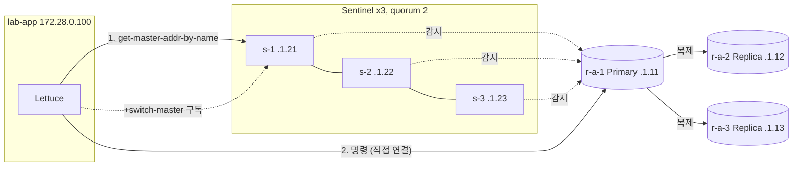
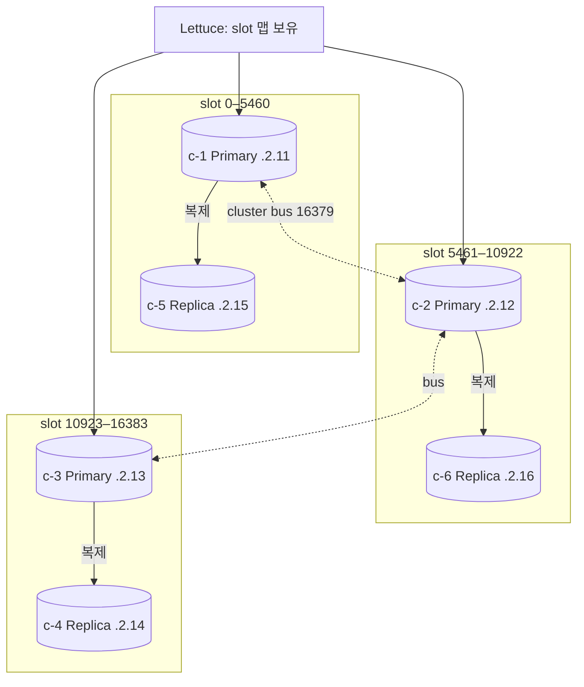
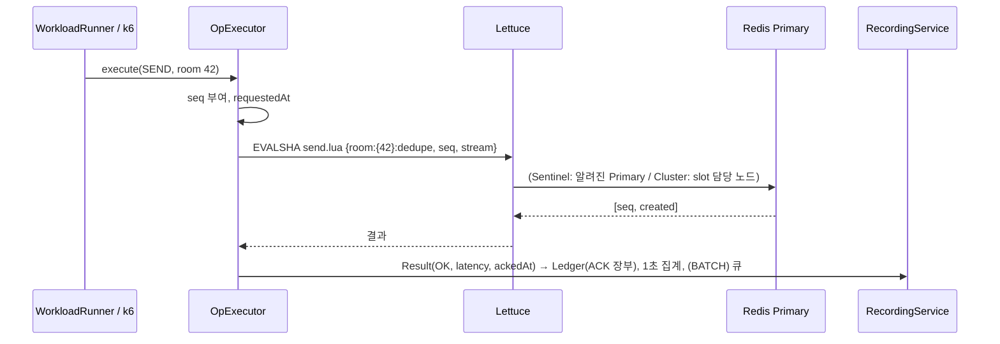
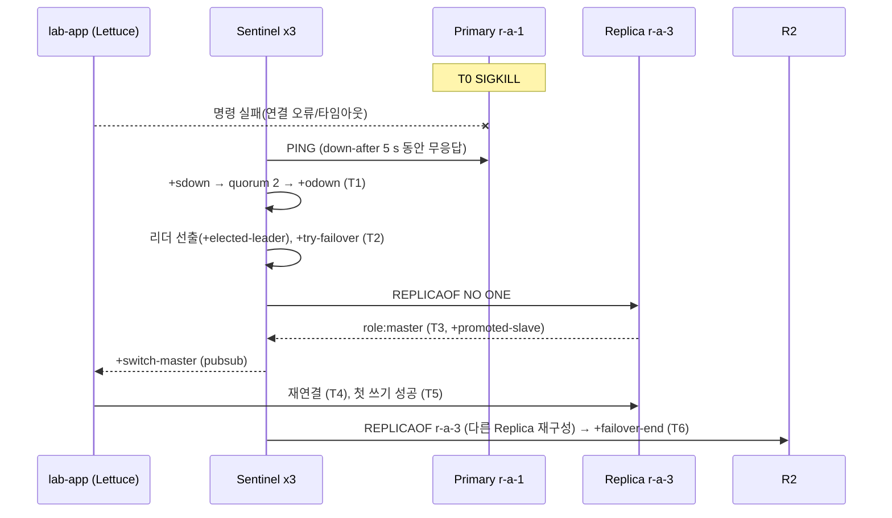
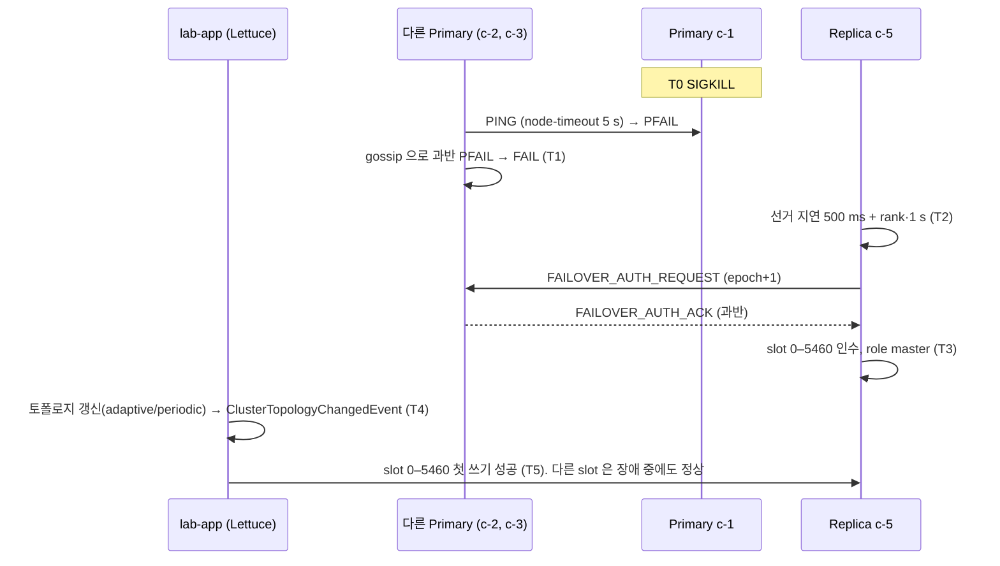
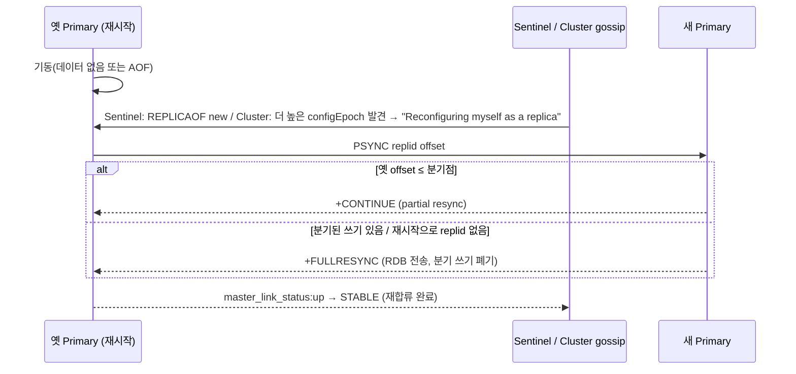

# 아키텍처와 시퀀스

## Sentinel 구성



Sentinel 은 프록시가 아니다. 앱은 Sentinel 에서 주소를 얻어 Redis 에 직접 붙고, `+switch-master` 를 구독해 승격을 알아챈다.

## Cluster 구성과 slot 분포



키 `room:{42}:seq` 처럼 중괄호 안(Hash Tag)만 CRC16 에 넣어 같은 방의 키를 한 slot 에 모은다. 사용자 키 `user:7:presence` 는 전체 키로 해시해 slot 이 흩어진다.

## 정상 요청 시퀀스



## Primary 장애와 Replica 승격 (Sentinel)



## Primary 장애와 Replica 승격 (Cluster)



## 옛 Primary 재합류



## 장애 주입 경로

```mermaid
flowchart LR
  UI[React] -- POST inject-failure {scenario, target, confirm} --> API[ExperimentService]
  API -- enum 검사·토큰·동시 1개·타이머 --> FE[FaultExecutor]
  FE -- stop/kill/pause/start --> SP[docker-socket-proxy] --> D[(Docker API)]
  FE -- exec drop.sh/netem.sh/clear.sh --> SC[fault-agent 사이드카 (노드 netns 공유)]
  FE -- toxics --> TP[Toxiproxy (앱↔Sentinel 만)]
```
