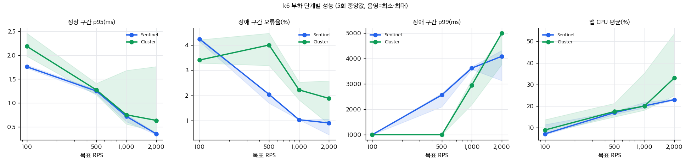

# EXP-PERF. 동일 부하 성능 비교 — 100 / 500 / 1,000 / 2,000 RPS 에서 정상·장애·복구 구간

```text
실험 이름: perf/KILL_PRIMARY/{sentinel,cluster}/rps{100,500,1000,2000}/rep1~5 (40회, k6 HTTP)
검증하려는 가설: (1) 정상 구간 p95 는 두 구성이 비슷하고 RPS 가 오르면 완만히 커진다.
                (2) 장애 구간 오류율은 "중단 시간 ÷ 창 길이" 에 수렴한다 — Sentinel 6.7 s/120 s ≈ 5.5 %, Cluster 는 1/3 키만 영향받아 11 s/120 s × 1/3 ≈ 3 %.
                (3) Cluster 는 1/3 키만 실패하므로 고부하에서 지연(p95/p99) 영향이 Sentinel 보다 작다.
변경한 항목: 목표 RPS 만 100 → 500 → 1,000 → 2,000 으로 변경. 구성(Sentinel/Cluster)은 별도 축.
통제한 조건: 같은 앱 이미지·JVM 옵션(-Xms512m -Xmx512m, G1GC)·Lettuce 설정(command timeout 1 s, Cluster adaptive+periodic 5 s, DEFAULT)·Redis 설정(down-after 5 s / node-timeout 5 s)·MySQL·k6 스크립트,
             실험마다 FLUSHALL 과 토폴로지 안정·쓰기 프로브 확인, Cluster 20회 → Sentinel 20회 순서(각 구성 안에서 100→2,000 을 5회 반복), 워밍업 1 분 뒤 측정.
서버 및 DB 사양: 호스트 Apple M5(10코어) 32 GB, macOS 26.6.2, Docker Desktop 29.6.1 VM 8 vCPU / 3.8 GB.
             앱 컨테이너 cpus 2.0 / 1 GB(OpenJDK 21.0.12, Tomcat max threads 200), Redis 7.4.11 노드 cpus 1.0 / 512 MB, k6 v2.1.0(호스트), MySQL 8(실험 기록 전용, 이 실험은 MEMORY 모드라 초당 1행만 기록).
테스트 데이터: 사용자 10,000, 방 100, 명령 비율 GET 50 / SET 20 / INCR 10 / SEND 15 / MGET 5. 실험 시작 시 FLUSHALL.
동시 사용자: k6 constant-arrival-rate(개방형). 사전 할당 VU = RPS/4, 최대 VU = max(200, 2×RPS). 요청 타임아웃 5 s.
전체 요청 수: 회당 RPS × 420 s = 42,000 / 210,000 / 420,000 / 840,000 (단계별 120 s 창에는 12,000 / 60,000 / 120,000 / 240,000).
테스트 지속시간: 회당 7 분(워밍업 1 → 정상 2 → Primary SIGKILL 후 2 → 복구 후 2). 총 40회, 4 시간 50 분(2026-09-05 22:33 ~ 09-06 03:23).
```

## 측정 결과 (5회 중앙값 [최소–최대]; 전체 표는 `docs/results.md` 7.1~7.4 절)



| 목표 RPS | 구성 | 정상 p50 / p95 / p99(ms) | 장애 구간 오류율 | 장애 구간 p95 / p99 / 최대(ms) | k6 드롭 반복(장애 창 대비) | 서비스 중단(ms) | 유실 / INCR 중복 | 복구 구간 p95(ms) | 앱 CPU 평균 / 최대(%) |
|---|---|---|---:|---|---:|---:|---:|---:|---:|
| 100 | Sentinel | 0.94 / 1.76 / 2.21 | **4.25 %** | 147 / 1,003 / 1,010 | 76 (0.6 %) | 6,653 | 0 / 0 | 1.74 | 7.1 / 14.0 |
| 100 | Cluster | 1.14 / 2.19 / 3.50 | 3.41 % | 2.7 / 1,002 / 1,012 | 22 (0.2 %) | 10,405 | 14 / 9 | 2.34 | 8.9 / 16.0 |
| 500 | Sentinel | 0.58 / 1.25 / 1.60 | 2.04 % | 1.6 / 2,568 / 3,270 | 1,154 (1.9 %) | 6,562 | 0 / 0 | 1.25 | 17.0 / 23.0 |
| 500 | Cluster | 0.56 / 1.27 / 2.37 | **4.01 %** | 2.6 / 1,002 / 1,038 | 91 (0.2 %) | 11,253 | 98 / 150 | 1.23 | 17.5 / 31.9 |
| 1,000 | Sentinel | 0.49 / 0.72 / 1.21 | 1.03 % | 0.9 / 3,625 / 4,844 | 3,634 (3.0 %) | 6,685 | 0 / 0 | 0.71 | 20.1 / 27.0 |
| 1,000 | Cluster | 0.41 / 0.75 / 1.71 | 2.22 % | **1,006** / 2,950 / 4,446 | 3,307 (2.8 %) | 10,923 | 49 / 203 | 0.75 | 20.0 / 27.9 |
| 2,000 | Sentinel | 0.27 / 0.35 / 0.81 | 0.90 % | 0.6 / 4,090 / **5,001** | 7,447 (3.1 %) | 6,675 | 0 / 0 | 0.40 | 23.0 / 29.5 |
| 2,000 | Cluster | 0.28 / 0.63 / 3.79 | 1.88 % | 86 / **5,000** / 5,003 | 10,985 (4.6 %) | 10,812 | 7 / 177 | 1.08 | 33.1 / 124.5 |

정상·복구 구간 오류율은 40회 모두 0.00 %. Redis 노드 CPU 최대는 2.4~9.6 %(docker stats 5 s 표본). 앱 메모리 최대 886~975 MB(컨테이너 상한 1 GB).

### 반복값 (5회 값 / 중앙값 / 표준편차)

| 목표 RPS | 구성 | 장애 구간 오류율(%) 5회 | 장애 구간 p99(ms) 5회 | k6 드롭 반복(건) 5회 | 서비스 중단(ms) 5회 |
|---|---|---|---|---|---|
| 100 | Sentinel | 4.30, 4.15, 4.25, 4.15, 4.29 / 중앙값 4.25 / 표준편차 0.07 | 1,003, 1,003, 1,003, 1,003, 1,003 / 중앙값 1,003 / 표준편차 0 | 76, 76, 76, 76, 76 / 중앙값 76 / 표준편차 0 | 6,712, 6,556, 6,653, 6,566, 6,693 / 중앙값 6,653 / 표준편차 64 |
| 500 | Sentinel | 1.69, 2.04, 2.04, 2.04, 2.04 / 중앙값 2.04 / 표준편차 0.14 | 2,104, 2,635, 2,563, 2,568, 2,618 / 중앙값 2,568 / 표준편차 199 | 855, 1,232, 1,154, 1,150, 1,227 / 중앙값 1,154 / 표준편차 139 | 5,462, 6,710, 6,553, 6,562, 6,722 / 중앙값 6,562 / 표준편차 475 |
| 1,000 | Sentinel | 1.03, 1.03, 1.03, 1.03, 1.03 / 중앙값 1.03 / 표준편차 0.00 | 3,685, 3,576, 3,625, 3,656, 3,588 / 중앙값 3,625 / 표준편차 41 | 3,669, 3,493, 3,634, 3,626, 3,660 / 중앙값 3,634 / 표준편차 64 | 6,709, 6,561, 6,685, 6,682, 6,723 / 중앙값 6,685 / 표준편차 58 |
| 2,000 | Sentinel | 0.43, 0.90, 0.93, 0.85, 1.05 / 중앙값 0.90 / 표준편차 0.21 | 3,135, 4,130, 4,090, 3,968, 4,322 / 중앙값 4,090 / 표준편차 413 | 6,327, 7,580, 7,566, 7,447, 7,658 / 중앙값 7,566 / 표준편차 499 | 5,508, 6,675, 6,697, 6,562, 6,708 / 중앙값 6,675 / 표준편차 464 |
| 100 | Cluster | 4.22, 3.41, 3.98, 3.29, 3.40 / 중앙값 3.41 / 표준편차 0.37 | 1,003, 1,003, 1,002, 1,002, 1,002 / 중앙값 1,002 / 표준편차 0 | 22, 24, 19, 22, 24 / 중앙값 22 / 표준편차 2 | 12,085, 10,030, 12,499, 9,738, 10,405 / 중앙값 10,405 / 표준편차 1,122 |
| 500 | Cluster | 4.48, 4.01, 3.19, 3.57, 4.13 / 중앙값 4.01 / 표준편차 0.45 | 1,002, 1,002, 1,002, 1,002, 1,002 / 중앙값 1,002 / 표준편차 0 | 88, 103, 107, 91, 77 / 중앙값 91 / 표준편차 11 | 13,225, 11,253, 8,489, 10,505, 11,722 / 중앙값 11,253 / 표준편차 1,554 |
| 1,000 | Cluster | 1.82, 2.28, 1.84, 2.22, 2.53 / 중앙값 2.22 / 표준편차 0.27 | 2,361, 3,105, 2,188, 2,950, 3,176 / 중앙값 2,950 / 표준편차 404 | 2,355, 3,689, 2,963, 3,307, 4,034 / 중앙값 3,307 / 표준편차 582 | 8,883, 11,939, 8,862, 10,923, 12,879 / 중앙값 10,923 / 표준편차 1,613 |
| 2,000 | Cluster | 1.63, 0.85, 2.10, 1.88, 2.58 / 중앙값 1.88 / 표준편차 0.57 | 4,887, 3,770, 5,000, 5,000, 5,000 / 중앙값 5,000 / 표준편차 482 | 9,615, 9,678, 11,679, 10,985, 13,791 / 중앙값 10,985 / 표준편차 1,537 | 9,880, 7,839, 10,848, 10,812, 13,036 / 중앙값 10,812 / 표준편차 1,680 |

편차: 서비스 중단은 Sentinel 이 표준편차 64~600 ms(변동계수 최대 9 %), Cluster 가 1,200~1,900 ms(최대 17 %)로 Cluster 의 선거 지연(랜덤 0~500 ms + 순위)과 클라이언트 갱신 주기(5 s) 때문에 더 흔들린다. 장애 구간 오류율은 Sentinel 이 0.07~0.15 %p, Cluster 가 0.4~0.5 %p 편차다.

이상치: Cluster 2,000 RPS rep2 의 정상 구간 최대 554 ms(다른 회차 58~118 ms)와 앱 CPU 5 s 표본 198.7 %(복구 50 s 뒤, 다른 표본 30~70 %)는 원인을 특정하지 못했다(토폴로지 갱신 또는 GC 로 추정, 미검증). 같은 회차의 p95·오류율·중단 시간은 다른 회차와 같은 범위라 중앙값에는 영향이 없다. Cluster 1,000 RPS rep3 는 정상 구간 p95 1.68 ms(다른 회차 0.56~1.01), 앱 CPU 최대 107 % 로 함께 높았다 — 5 s 표본 하나가 실험 전 구간(워밍업)에 걸친 것으로, 기준 구간 오류는 0 이었다.

## 병목 원인

**장애 구간의 병목은 Redis 가 아니라 앱의 요청 스레드 풀(Tomcat 200)이었다.** 근거:

1. Sentinel 의 장애 구간 `TIMEOUT` 건수가 RPS 와 무관하게 **정확히 1,000~1,200** 이다(500 RPS 5회 중 4회 1,200, 1,000 RPS 5회 모두 1,200, 2,000 RPS 5회 모두 1,000). 200 스레드가 죽은 Primary 를 향한 요청을 1 s(Lettuce timeout)씩 붙들면 초당 최대 200건이 실패하고, 6 s 남짓의 중단 동안 1,200건이 그 상한이다. 100 RPS(초당 100건 < 200 스레드)에서만 상한에 걸리지 않아 오류율이 중단 창 비율(4.25 % ≈ 6.65 s/120 s × 실제 도착률)에 근접했다.
2. 상한을 넘는 요청은 실패하지 않고 **대기열에서 기다렸다**: 장애 구간 p99 가 100 RPS 1.0 s → 500 RPS 2.6 s → 1,000 RPS 3.6 s → 2,000 RPS 4.1 s 로 늘었고, 2,000 RPS 에서는 k6 의 5 s 요청 타임아웃에 걸린 `HTTP_ERR` 가 5회 중 4회에서 969~1,431건 나타났다(rep1 은 최대 4.9 s 로 0건, 다른 단계에서는 0).
3. 그래도 못 보낸 요청은 k6 가 **버렸다**(`dropped_iterations`): 최대 VU(2×RPS)가 대기 중인 요청으로 다 차면 새 반복을 시작하지 못한다. 500 RPS 1.9 % → 2,000 RPS 3.1 %(Sentinel), Cluster 2,000 RPS 4.6 %.

즉 "오류율 4.25 % → 0.90 %" 는 개선이 아니라 **실패의 형태가 오류에서 지연과 드롭으로 옮겨 간 것**이다. 오류 + 드롭을 합치면 Sentinel 은 100 RPS 4.9 %, 500 RPS 3.9 %, 1,000 RPS 4.0 %, 2,000 RPS 4.0 % 로 어느 단계에서나 중단 창(약 5.5 %)에 가깝다.

## 해석

- **가설 (1) 은 반만 맞았다.** 정상 구간 오류율은 0 이고 두 구성의 p95 는 500 RPS 이상에서 거의 같다(1.25 vs 1.27, 0.72 vs 0.75 ms). 100 RPS 에서는 Cluster 가 0.4 ms 느리다(2.19 vs 1.76 ms; 요청이 세 노드로 흩어져 연결별 활동이 낮아진 것으로 추정). 그러나 지연이 RPS 에 따라 커지지 않고 **오히려 줄었다**(p50 0.94 → 0.27 ms). 2,000 RPS 에서도 앱 CPU 평균 23~33 %, Redis 5~10 % 로 여유가 커서, 낮은 부하에서의 긴 지연은 유휴 코어·스레드를 깨우는 비용(CPU 절전, JIT 온도)으로 추정한다(검증하지 않음). 이 환경의 처리 한계는 2,000 RPS 밖에 있다.
- **가설 (2) 는 100 RPS 에서만 성립했다.** Sentinel 4.25 %(예상 5.5 %; T0 이전 도착분과 재연결 직후 성공분 차이), Cluster 3.41 %(예상 3 %). 그 이상에서는 스레드 풀 상한이 오류 수를 고정해 오류율이 RPS 에 반비례해 보인다. 오류율만으로 고부하 결과를 비교하면 착시다.
- **가설 (3) 은 기각.** Redis 수준에서는 Cluster 가 1/3 키만 실패하지만(앱 내부 초별 집계에서 성공 0건인 초 0), 죽은 shard 로 가는 요청이 스레드를 1 s 씩 점유하면 **건강한 shard 요청도 같은 대기열에서 기다린다.** 1,000 RPS 에서 Cluster 의 장애 구간 p95 가 1,006 ms(Sentinel 0.9 ms)인 이유는 중단이 더 길어(10.9 s vs 6.7 s) 지연 영향을 받은 요청 비율이 5 % 를 넘었기 때문이다(Cluster 약 10,900 − 드롭 3,300 = 7,600건 ≈ 6.3 %, Sentinel 약 6,700 − 3,600 = 3,100건 ≈ 2.5 %). shard 격리를 앱까지 이어 가려면 shard 별 동시 실행 상한(bulkhead)이나 더 짧은 타임아웃 + `REJECT_COMMANDS` 처럼 죽은 shard 요청이 스레드를 오래 잡지 못하게 하는 장치가 필요하다.
- **정합성은 300 RPS 결과와 같다.** Sentinel 은 모든 단계에서 유실 0·중복 0. Cluster 는 유실 7~98, INCR 중복 9~203 으로 RPS 가 오를수록 중복이 늘었다 — 끊긴 동안 버퍼에 쌓이는 명령 수가 부하에 비례한다(EXP-OPT: `REJECT_COMMANDS` 로 0). 유실은 2,000 RPS 에서 7건으로 오히려 적었는데, 부하가 높을수록 복구 직후 같은 키가 새 값으로 빨리 덮여 "잘못된 값" 으로 남는 키가 줄기 때문이다(측정 정의상 마지막 ACK 보다 낮은 값만 유실로 센다).
- **자원.** Redis CPU 최대 10 % 미만으로 Redis 는 어느 단계에서도 병목이 아니다. 앱은 CPU 평균이 7 → 23 %(Sentinel), 9 → 33 %(Cluster)로 올랐고 Cluster 가 2,000 RPS 에서 10 %p 더 쓴다(노드별 연결 6개, 5 s 주기 `CLUSTER NODES` 파싱, MOVED 처리). 앱 메모리는 상한 1 GB 의 89~97 % 라 다음 단계(4,000 RPS)는 상한을 올리지 않으면 잴 수 없다.

## 부작용·한계

- k6 가 앱과 같은 장비에서 돈다. 2,000 RPS 에서 k6 자체가 호스트 CPU 를 쓰므로 절대 지연은 낮게 신뢰하지 않는다.
- 최대 VU = 2×RPS 는 부하 생성기 설정이며 드롭의 직접 원인이다. VU 를 더 주면 드롭이 대기와 HTTP 타임아웃으로 바뀔 뿐 서버 쪽 병목(스레드 200 × 1 s)은 같다.
- HTTP 왕복이 앱 내부 지연(p95 0.1~0.5 ms)에 0.3~1.5 ms 를 더한다. Redis 명령 자체의 비교는 앱 내부 워크로드(300 RPS, `docs/results.md` 2절)가 더 정확하다.

## 결론

2,000 RPS 까지 정상 구간은 두 구성 모두 오류 0·p95 1.3 ms 이하로 차이가 없었다. 장애 구간에서는 **500 RPS 부터 Tomcat 200 스레드가 죽은 Primary 를 1 s 씩 기다리는 요청으로 가득 차**(TIMEOUT 이 1,200 = 200 스레드 × 6 s ÷ 1 s 로 고정) 나머지 요청이 대기열에서 기다렸고, p99 가 1.0 s → 2.6 s → 3.6 s → 4.1 s 로 늘었으며, 2,000 RPS 에서는 k6 의 5 s 타임아웃(HTTP_ERR 약 1,000~1,400건)과 VU 소진(드롭 3 %)이 나타났다. Cluster 는 Redis 수준에서 1/3 키만 실패했지만 앱 스레드 풀이 격리되지 않아 1,000 RPS 부터 p95 가 1 s 에 닿았다(Sentinel 0.9 ms). 이력서 문장에 쓸 값은 이 실험이 아니라 300 RPS 앱 내부 워크로드의 중단 시간(EXP-AB)과 Lettuce 설정 전후 오류율(EXP-OPT)이며, 이 실험은 "오류율이 낮아 보이는 고부하 결과는 지연과 드롭까지 봐야 한다" 는 해석 규칙을 준다.

## 다음 실험

shard 별 bulkhead(세마포어) 또는 요청 처리에 가상 스레드 사용 → 장애 구간 p95/p99 재측정; Lettuce timeout 300 ms + `REJECT_COMMANDS` 조합으로 스레드 점유 시간 단축; 앱 메모리 상한 2 GB·k6 최대 VU 상향 뒤 4,000 RPS.
